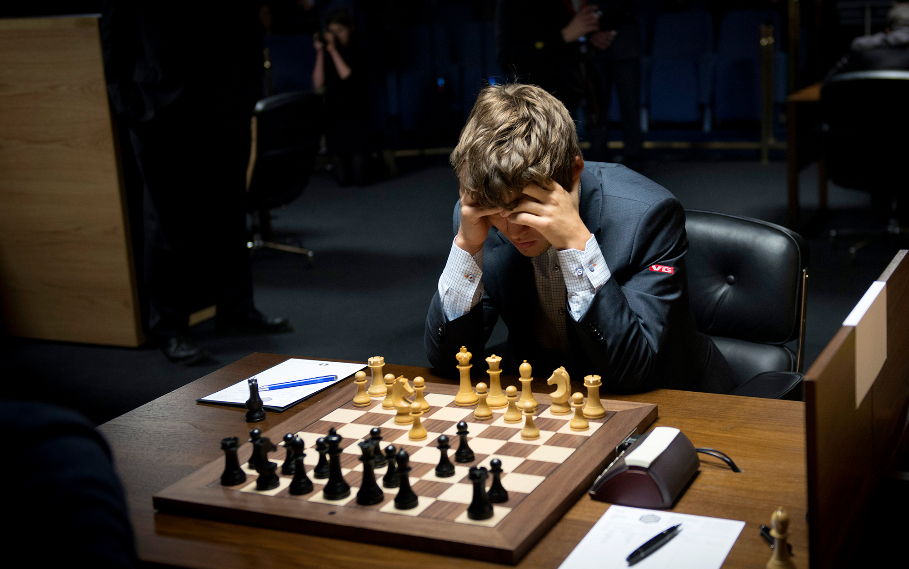

```{r setup, echo=FALSE, results='hide', message=FALSE, warning=FALSE}
knitr::opts_chunk$set(echo=FALSE, message=FALSE, warning=FALSE)

# Uvoz vseh potrebnih knjižnic
source("lib/libraries.r", encoding="UTF-8")
```


## Izbira teme

Za projektno nalogo sem si izbral tematiko šaha. Osredotočil sem se na partije aktualnega prvaka Norvežana Magnusa Carlsena, ki je na samem vrhu že od leta 2013. Naziv šahovskega velemojstra je dobil leta 2004, ko je pri 13-ih zmagal v skupini C na Corus chess tournament v Wijk aan Zee na Nizozemskem. Za analizo bom iskal podobnosti v otvoritvah med njegovimi partijami preko spletne platforme [Lichess](https://lichess.org/) med leti 2017 in 2021 in njegovimi partijami v živo s turnirjev, od leta 2001 do decembra 2021 ter njegove ratinge preko spleta in njegovega FIDE ratinga skozi čas. Kasneje bom primerjal njegovo število odigranih partij v posamezni državi in število velemojstrov v tej državi, ter iskal povezave med številom velemojstrov v državi, njenim BDP-jem in izdatki za izobrazbo.


<center>
{width=80%}

***

## Obdelava, uvoz in čiščenje podatkov

```{r uvoz}
source("uvoz/uvoz.r", encoding="UTF-8")
```


Podatke, potrebne za analize sem uvozil v oblikah CSV, PGN in HTML. Podatke sem prečistil in spremenil v obliko *tidy data* ter tako dobil več manjših tabel.

1. Dve tabeli za rezultate v živo in preko spleta
  - `Rezultat`
  - `Število iger`
  - `Odstotek`
  
2. Štiri tabele različnih velikosti za otvoritve glede na barvo in tip partije
  - `Rezultat`
  - `Barva`
  - `Otvoritev`
  - `Število iger`
  - `Odstotek`
  
3. FIDE ratingi
  - `Rating`
  - `Datum`
  
4. Ratingi preko spleta
  - `ID` 
  - `Account`
  - `Rating`
  
5. Lokacije Magnusovih partij
  - `Država`
  - `Število iger`

6. Države in število velemojstrov
  - `Država`
  - `Število velemojstrov`
  - `Prebivalstvo`
  - `Velemojstri per capita`
  - `BDP per capita`
  - `Delež BDP-ja za izobraževanje`

***

## Analiza in vizualizacija podatkov

```{r vizualizacija, results='hide'}
source("vizualizacija/vizualizacija.r", encoding="UTF-8")
```


```{r graf_rezultati, echo=FALSE, fig.align='center'}
graf_rezultati
```

Za začetek sem izračunal število zmag, porazov in remijev preko spleta ter v živo. Vse skupaj sem predstavil kot deleže vseh skupnih partij. Iz grafov je jasno razvidna razlika v težavnosti v živo proti velemojstrom in preko spleta proti približno enakovrednim nasprotnikom. 
<br>
<br>

```{r graf_otvoritve, echo=FALSE, fig.align='center'}
graf_otvoritve
```

Za analizo otvoritev sem se odločil, da vzamem zgolj njegove zmage. Iz grafov lahko razberemo, da najraje igra tako imenovan Queen's pawn game, kjer se igra začne z d4. Ta otvoritev mu je blizu ne glede na barvo in tip igre. Glavne razlike vidimo ko pride do Uncommon Openinga, oz. neobičajne otvoritve, ki se preko spleta pogosteje pojavlja, saj ljudje raje poskušajo nove in nenavadne otvoritve.
<br>
<br>

```{r graf_ratingi, echo=FALSE, fig.align='center'}
graf_ratingi
```

Izmed vseh Magnusovih partij preko spleta, sem moral razdeliti partije na dva dela, saj je v glavnem igral na dveh različnih uporabniških računih. Oba ratinga se precej razlikujeta, saj verjetno igra z enim računom bolj za zabavo kot drugim. To se pozna tudi v naglih padcih ratinga, kar pomeni, da je igral proti precej nižje rangiranimi igralci in posledično ob porazu naenkrat izgubil občutno število točk. Čeprav se spletne platforme za šah trudijo čimbolj približati njihov rating k dejanskemu FIDE ratingu, je to zelo težko. Čeprav je Magnus Carlsen dosegel najvišji FIDE rating v zgodovini šaha maja 2014, in sicer 2882, je še zmeraj daleč od svojih ratingov preko spleta. Kot lahko opazimo ratingi preko spleta neprestano skačejo, medtem ko se rating v živo spreminja ob koncu posameznega turnirja, zato so ti ratingi tudi toliko bolj relevantni.
<br>
<br>


```{r zemljevida, echo=FALSE, fig.align='center'}
zemljevida
```

Prva dva zemljevida predstavljata  število velemojstrov v državi in pa velemojstre per capita v državi. Po samem številu močno prevladuje Rusija, ki ima 133 velemojstrov več kot njena sosednja država, Ukrajina, ki jih ima druga največ. Pri številu velemojstrov per capita pa močno prevladuje Islandija s približno 38 velemojstrov per capita. 


***

## Napredna analiza podatkov

```{r analiza}
source("analiza/analiza.r", encoding="UTF-8")
```

<br>
<br>
```{r graf_napoved, echo=FALSE, fig.align='center'}
graf_napoved
```
<br>
<br>
S pomočjo modela naključnih gozdov, sem poskusil napovedati Magnusove prihodnje ratinge. Privzel sem, da se rating spremeni približno na dva mesca. Zato sem se odločil napovedati naslednjih 12 vrednosti, torej 2 leti. Glede na napoved, bi v prihodnosti bila manjša nihanja, torej brez večjih sprememb. Potemtakem bi moral še vedno držati najvišji rating.


<br>
<br>
```{r premica1, echo=FALSE, fig.align='center'}
premica1
```
<br>
<br>
V korelaciji števila velemojstrov v odvisnosti od BDP per capita so podatki kar razpršeni, vendar je povprečje skoraj konstantno in se le minimalno spreminja glede na velikost BDP-ja.

```{r premica2, echo=FALSE, fig.align='center'}
premica2
```
<br>
<br>
Po drugi strani pa so podatki o številu velemojstrov per capita v odvisnosti od BDP per capita manj razpršeni ter je število velemojstrov per capita nekoliko bolj odvisno od BDP-ja per capita, saj se z večanjem BDP-ja per capita veča tudi število velemojstrov per capita.


<br>
<br>
<br>
<br>

```{r zemljevid4, echo=FALSE, fig.align='center'}
zemljevid4
```
Z metodo voditeljev sem poskušal grupirati države s podobnimi lastnostmi glede na njihovo število velemojstrov, njihov BDP per capita ter njihovim številom prebivalcev. S pomočjo obrisov sem prišel do optimalnega števila skupin, in sicer vidimo, da je ena skupina
sestavljena samo iz Islandije, ena je sestavljena iz bolj razvitih držav Evrope, ZDA in Avstralije, zadnja pa preostali del sveta. Islandija spada v svojo skupino posebej zaradi zelo visokega števila velemojstrov per capita.


<br>
<br>


```{r zemljevid1, echo=FALSE, fig.align='center'}
zemljevid1
```

Na  zemljevidu je predstavljeno število partij, ki jih je odigral v sklopu turnirjev v posamezni državi. Rusi so bili že iz časov Sovjetske Zveze svetovno znani po njhovih šahovskih velemojstrih, zato ne preseneča, da je Magnus tam odigral daleč največje število partij. Zanimivo je, da čeprav šahovski turnirji za Slovenijo niso tuji, Magnus ni nikoli odigral partije na naših tleh.
<br>
<br>
Spodaj si lahko pogledamo število partij v posamezni državi za vsako njegovo profesionalno leto., torej med leti 2001 in 2021.

***

```{r shiny}
shinyAppDir("shiny", options=list(width="100%", height=500))
```

*** 

## Zaključek

Pri preučevanju podatkov sem prišel do sklepa, da je najbolj efektivna otvoritev Queen's pawn opening ne glede na tip partije. Videl sem, da se tudi najboljšim da zgoditi, da jim lahko rating naglo pade, kadar igrajo preko spleta in pa čeprav o Rusih v šahu ne slišimo toliko kot v prejšnjem stoletju, so še vedno po številu velemojstrov in organizaciji turnirjev na samem vrhu. Pri primerjavi pa sem prišel do zaključka, da na število velemojstrov sam BDP ne vpliva preveč, vpliva pa na njihovo število per capita.
